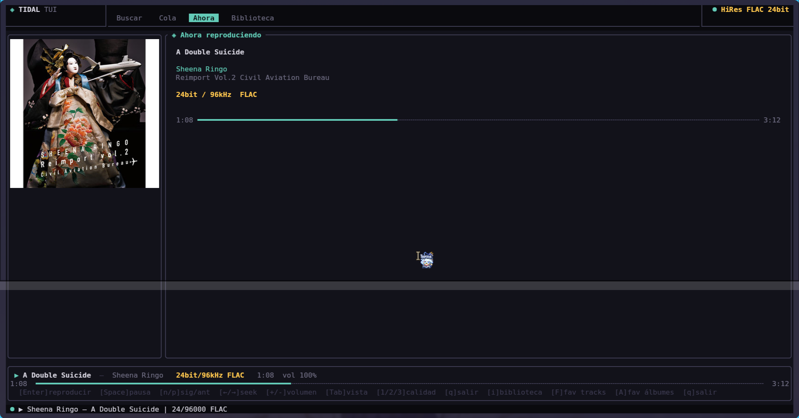
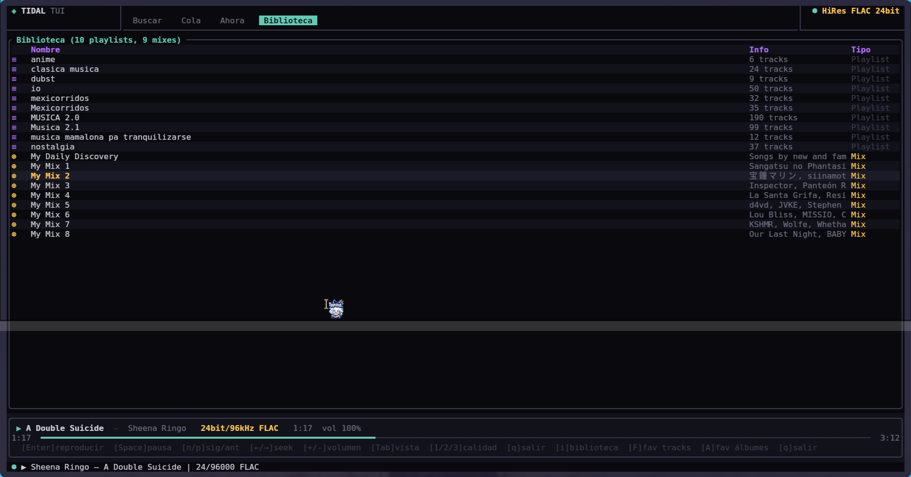
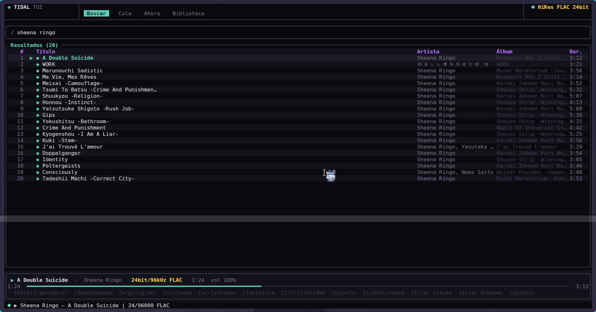
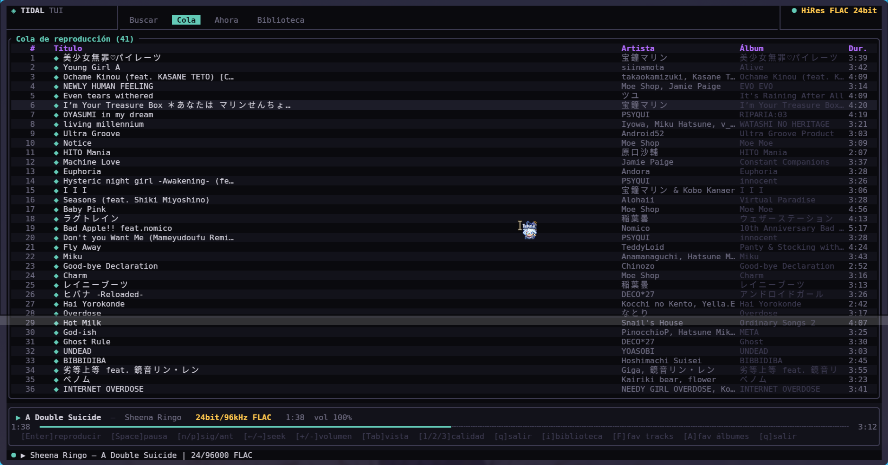

# Tuidal

A terminal music player for Tidal, built with Rust and ratatui. Streams lossless audio directly in your terminal with album art support via the Kitty graphics protocol.






## Features

- 🎵 Stream FLAC lossless and HiRes audio
- 🖼️ Album art rendered inline (Kitty terminal)
- 🔍 Search tracks
- 📋 Queue management
- 📚 Library — playlists, mixes, favorites
- ⚡ Non-blocking UI with async background operations
- 🔑 OAuth Device Flow authentication (no password required)

---

## Requirements

### System

- [Rust](https://rustup.rs/) (edition 2024)
- [mpv](https://mpv.io/) — audio playback
- [Python 3.10+](https://www.python.org/) with [tidalapi](https://github.com/EbbLabs/python-tidal)
- [Kitty terminal](https://sw.kovidgoyal.net/kitty/) — for album art (optional)

### Python dependency

```bash
pip install tidalapi
```

---

## Installation

```bash
git clone https://github.com/youruser/tuidal
cd tuidal
cargo build --release
```

Copy `tidal.py` to the same directory as the binary:

```bash
cp tidal.py target/release/
```

Or run directly from the project root with `cargo run`.

---

## NixOS

Enter a development shell with all dependencies:

```bash
nix-shell -p rustup mpv pkg-config openssl
```

For Python with tidalapi, use a virtual environment (see below) or add it to your shell:

```nix
# shell.nix
{ pkgs ? import <nixpkgs> {} }:
pkgs.mkShell {
  buildInputs = with pkgs; [
    rustup
    mpv
    pkg-config
    openssl
    python3
  ];
  PKG_CONFIG_PATH = "${pkgs.openssl.dev}/lib/pkgconfig";
}
```

Then install tidalapi inside the shell:

```bash
pip install tidalapi --break-system-packages
```

Or use a virtual environment (recommended on NixOS):

```bash
python3 -m venv ~/my_python
~/my_python/bin/pip install tidalapi
```

### Python Executable Path (`TUIDAL_PYTHON_PATH`)

By default, tuidal uses `python3` as the executable. You can specify a custom Python interpreter **without modifying the code** by setting the environment variable `TUIDAL_PYTHON_PATH` before running tuidal.

**Example:**

```bash
export TUIDAL_PYTHON_PATH="/home/youruser/my_python/bin/python3"
cargo run # or ./target/release/tuidal
```

If not set, tuidal defaults to running `python3` from your system PATH. This makes tuidal portable across environments, virtualenvs, and OS distributions.

---

## Tidal Authentication

tuidal uses the **OAuth Device Flow** — no password is stored or required.

### Option A — from inside the TUI

1. Run tuidal and press `L`
2. A URL and code will appear on screen
3. Open the URL in your browser, log in to Tidal, and enter the code
4. The session is saved automatically to `~/.config/tidal-tui/tidalapi_session.json`

### Option B — from the command line (recommended for first login)

```bash
python3 tidal.py auth start
```

Output:
```
{"url": "link.tidal.com/XXXXX", "code": "XXXXX"}
```

Open the URL in your browser, log in to Tidal, and enter the displayed code. The process will block until you authorize, then save the session automatically.

### Check if you are logged in

```bash
python3 tidal.py auth poll
```

If logged in:
```json
{"authenticated": true}
```

If not logged in:
```json
{"authenticated": false, "pending": false}
```

Sessions are reused automatically on subsequent runs. If the session expires, run `auth start` again or press `L` inside the TUI.

---

## Usage

```
cargo run
# or after build:
./target/release/tuidal
```

### Keybindings

| Key | Action |
|-----|--------|
| `/` or `s` | Search |
| `Enter` | Play selected |
| `Space` | Pause / Resume |
| `n` / `p` | Next / Previous track |
| `←` / `→` | Seek backward / forward |
| `+` / `-` | Volume up / down |
| `Tab` | Cycle tabs (Search → Queue → Now → Library) |
| `i` | Load library (on Library tab) |
| `j` / `k` or `↓` / `↑` | Navigate list |
| `1` | Quality: HiRes FLAC 24bit |
| `2` | Quality: FLAC 16bit/44.1kHz |
| `3` | Quality: AAC 320kbps |
| `L` | Login to Tidal |
| `q` | Quit |

---

## Project Structure

```
tuidal/
├── src/
│   ├── main.rs       # Entry point, event loop
│   ├── app.rs        # Application state and background tasks
│   ├── ui.rs         # Terminal UI rendering (ratatui)
│   ├── tidal.rs      # Rust client — calls tidal.py as subprocess
│   └── player.rs     # mpv subprocess wrapper
├── tidal.py          # Python bridge to tidalapi
└── Cargo.toml
```

---

## How It Works

tuidal uses a two-process architecture:

```
Rust TUI  ──subprocess──►  tidal.py  ──►  Tidal API
(ratatui)                  (tidalapi)
```

`tidal.py` handles all Tidal API calls and OAuth authentication via [tidalapi](https://github.com/EbbLabs/python-tidal). It communicates with the Rust process via stdin/stdout as JSON. This approach avoids dealing with Tidal's unofficial API credentials directly in Rust, and benefits from tidalapi's maintained session handling.

---

## Cargo.toml dependencies

```toml
[dependencies]
ratatui       = "0.29"
crossterm     = { version = "0.28", features = ["event-stream"] }
tokio         = { version = "1", features = ["full"] }
reqwest       = { version = "0.12", features = ["json", "blocking"] }
serde         = { version = "1", features = ["derive"] }
serde_json    = "1"
anyhow        = "1"
libc          = "0.2"
ratatui-image = "6"
image         = "0.25"
```

---

## Notes

- Audio quality depends on your Tidal subscription. If HiRes is unavailable for a track, tuidal automatically falls back to Lossless, then High.
- Album art requires the Kitty terminal. In other terminals, a placeholder is shown.
- This project uses tidalapi, an unofficial Tidal API client. Use it only for personal use and in accordance with Tidal's terms of service.

---